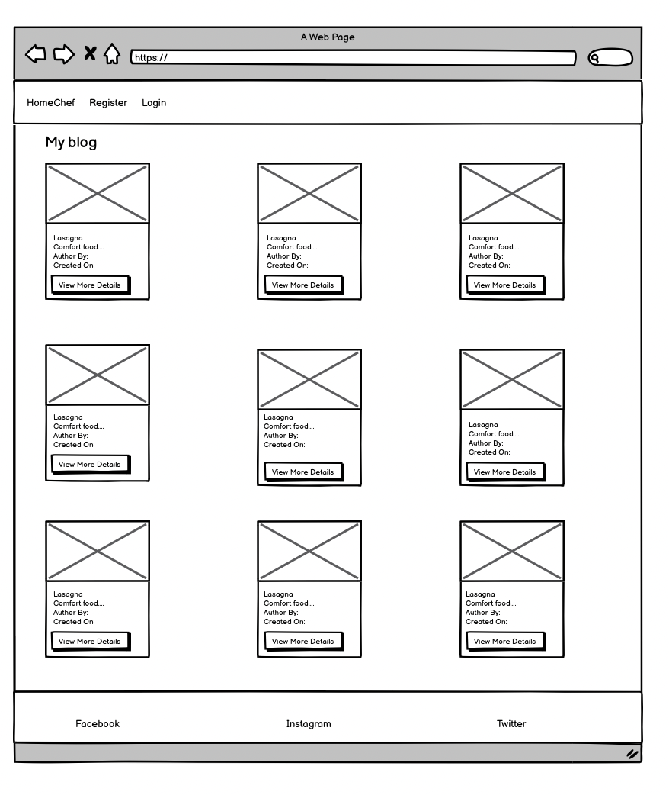
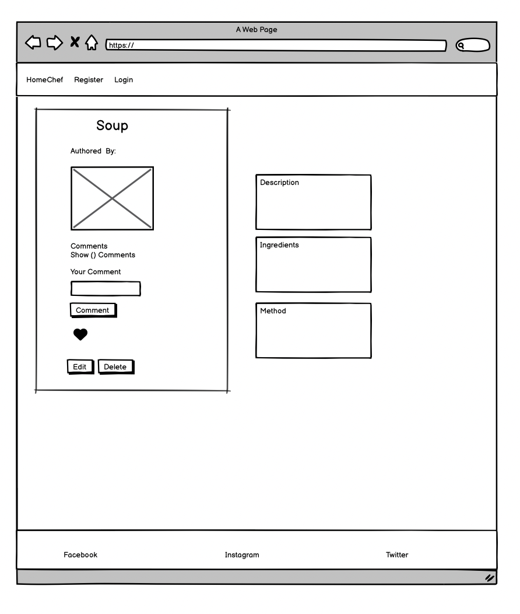
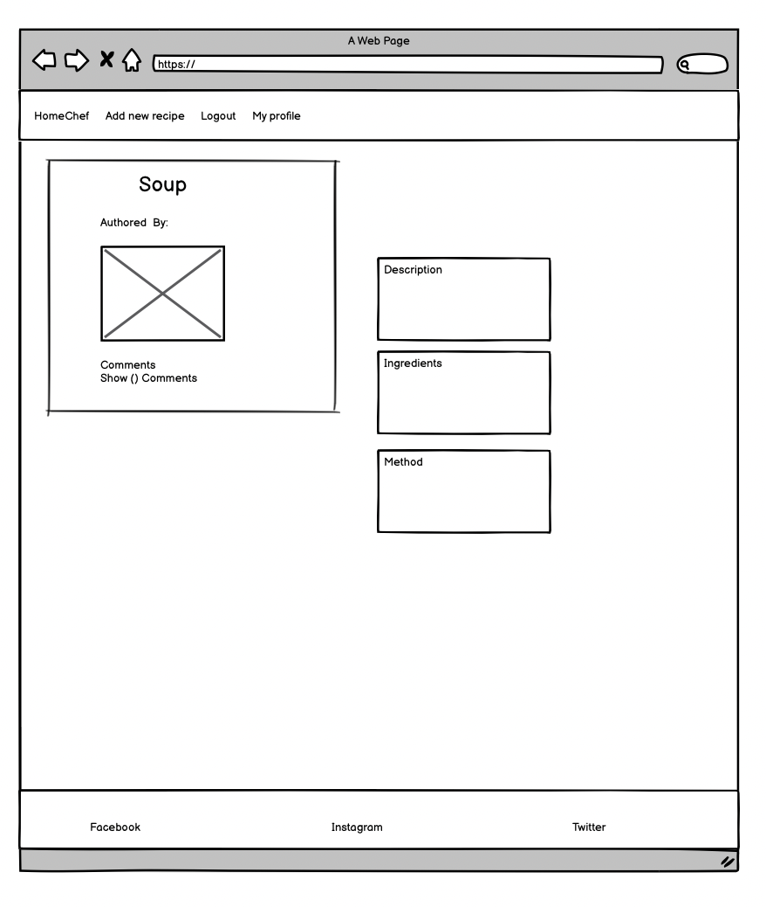
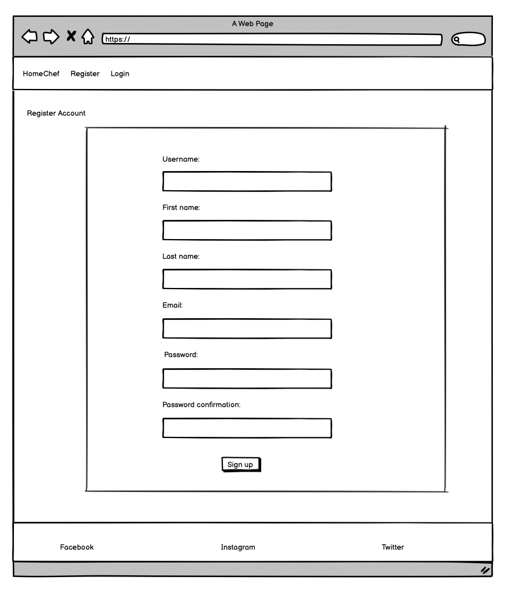
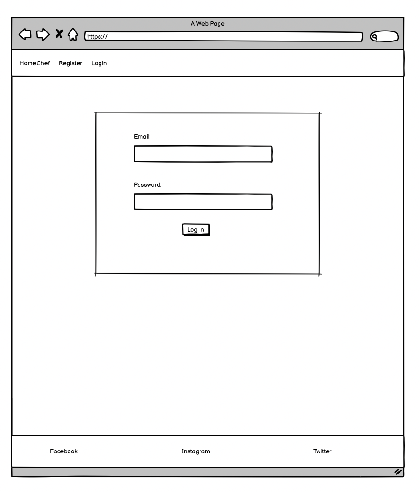
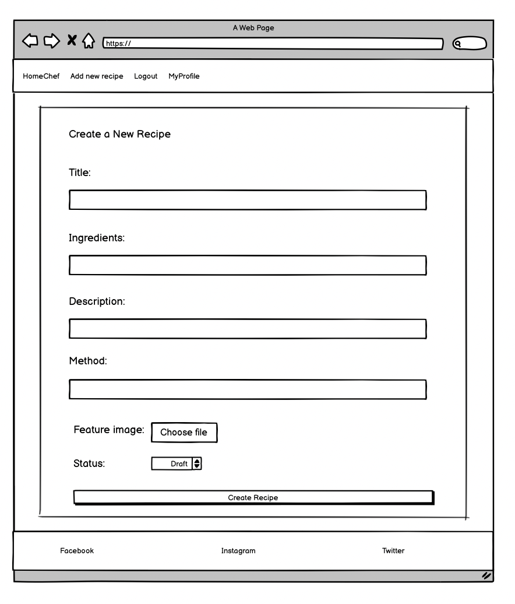
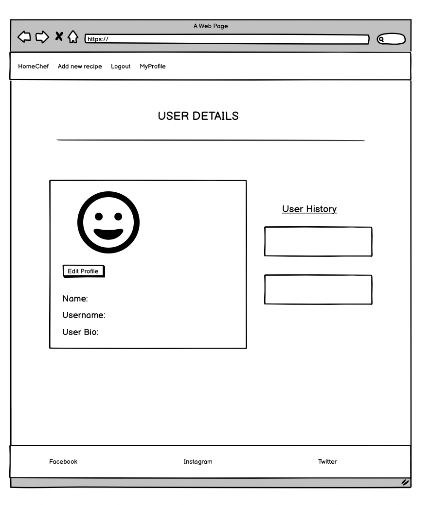
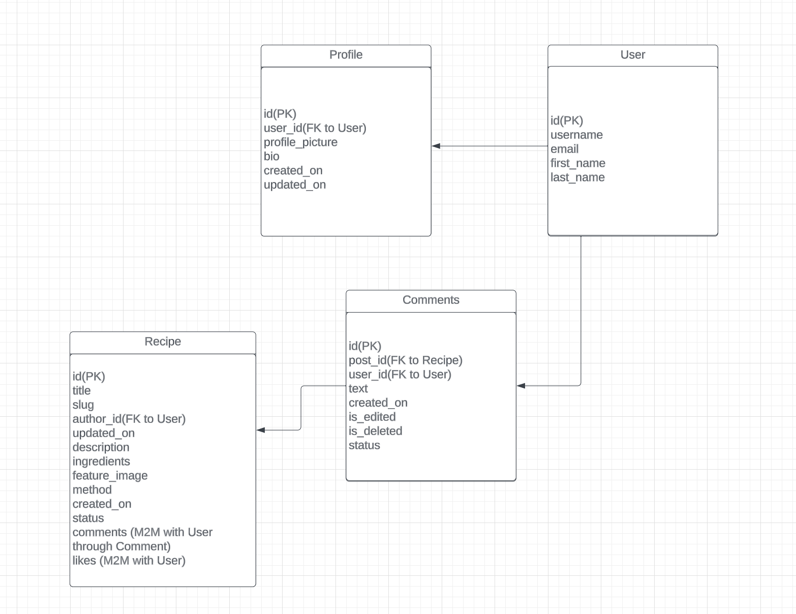
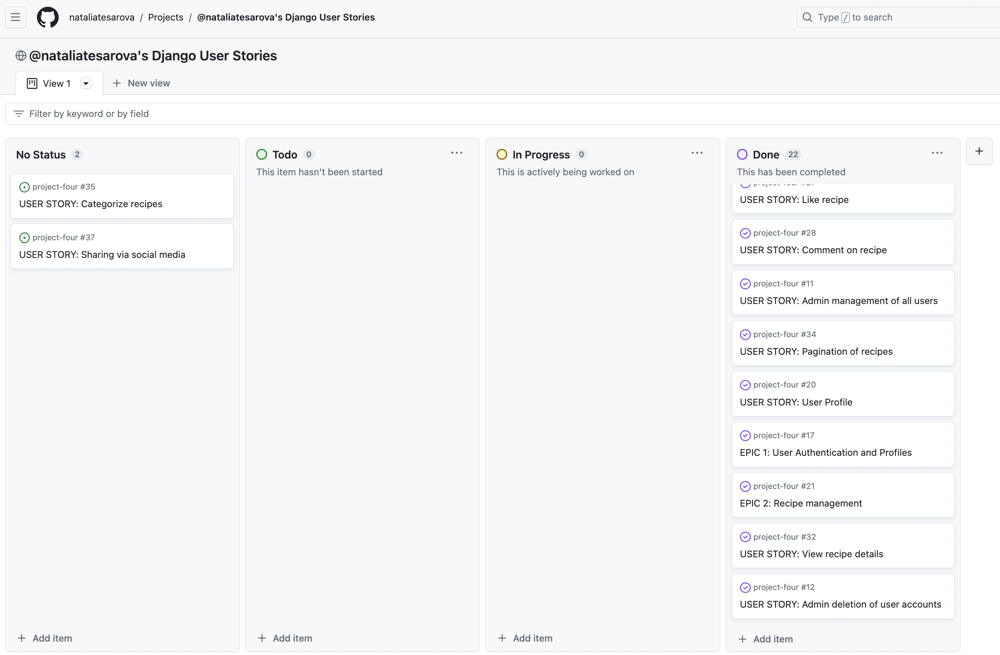

# Recipe

## Description

HomeChef, a web platform crafted with Django using Python, JavaScript, CSS/Bootstrap, and HTML, is a celebration of heart warming home-cooked meals.
Tailored for home cooks around the globe, this website provides a virtual haven for users passionate about sharing their culinary creations. Whether you're a seasoned home chef or an enthusiastic cook, HomeChef empowers you to create and share your favorite home-cooked recipes.
HomeChef  was created as the fourth project for the Code Institute Diploma in Software Development. The site features include user authentication and full CRUD functionality.
Users are given the ability to elevate their dishes with appealing photos, share their cooking through visual elements, and gives the option to like and comment on the recipes.
Link to the live site - [HomeChef](https://recipeblog-e0d016298fa8.herokuapp.com/)

## Design

#### Wireframe mock-ups

[Balsamiq](https://balsamiq.com/) was used to design the wireframes for my website.

#### Database Schema

The database schemas were designed using [Lucid App](https://lucid.app/) These schemas were pivotal in planning the database models and defining their respective fields. They also facilitated visualizing the relationships between the models and their interactions. Recipe comprises four models: Recipe, Profile, User and Comment.

## Agile Development

The project applied Agile Methodology on GitHub for planning and execution. User Stories were established as GitHub issues, outlining their purposes distinctly. Each story contained specific acceptance criteria and tasks, categorized using colored labels such as 'must-have', 'should-have', 'could-have', or 'won't-have' to manage tasks during iterations.

Additionally, 4 Epics were initiated and expanded into 20 User Stories. Each of these stories was also assigned story points based on their complexity.

### Epics

1. User Authentication and Profiles [#1](https://github.com/users/nataliatesarova/projects/6/views/1?pane=issue&itemId=39537085)
2. Recipe management#21 [#2](https://github.com/users/nataliatesarova/projects/6/views/1?pane=issue&itemId=39569106)
3. Interaction with recipes [#3](https://github.com/users/nataliatesarova/projects/6/views/1?pane=issue&itemId=39571127)
4. Admin panel and content management [#4](https://github.com/users/nataliatesarova/projects/6/views/1?pane=issue&itemId=39536019)

A full list of user stories can be found in the [HomeChef] (https://github.com/users/nataliatesarova/projects/6/views/1).

### User stories

User Authentication and Profiles
*As a new user i can complete a registration form with fields for username, name, email and password so that I can access the site to post recipes, comments and likes

## Future features
Allow the user to save a draft version of a recipe to edit and complete at a later time.
Bio to be available for all registered users to view
Recipe Search and Filters: Allow users to search for recipes using keywords, ingredients, cuisine, and dietary preferences (e.g. gluten free, vegan)
Recipe Categories: Categorize recipes into sections such as breakfast, lunch, dinner, desserts.
Add difficulty level, serving size, nutritional and calorific information.
Newsletter Subscription: Provide a subscription option for users to receive regular updates on new recipes, cooking tips, and the latest blog updates.
Enable sharing of recipes directly via social media.

## Features
### Navigation bar
The Navigation Bar is prominently positioned at the top of the page, with the navigation links aligned to the left side. When a user is logged in, certain links undergo changes; for instance, the Login transforms into Logout, "Register" link changes to "Add New Recipe," and a "MyProfile" link is added. For smaller screen sizes, a hamburger menu is utilized to display the navigation links.

### Homepage
The homepage is accessible to all users, even without registration or logging in. It features recipe cards displaying a featured image, recipe title, author, and creation date. A "View More Details" button, allows all users to explore the recipes. The home and subsequent pages have the capacity to display a maximum of 9 cards.

### Recipe details
Registered and logged in users are able to view, edit, comment and like recipes. Users not registered or logged in will only be able to view recipe details, without the ability to edit, comment or like.

### Registered login
During registration the user must complete all the required fields: username, first name, last name, email, password, and password confirmation. Login requires the entering of both the email and password fields. After logging in the user will be redirected to the main page with recipes.

### Add new recipe
The registered and logged in user will have the option to add a recipe by clicking on the ‘Add new recipe’ option on the navigation bar. The user must enter the fields for Title, Description, Ingredients and Method. If the user does not enter all off these fields and click the submission ‘Create Recipe’ button a ‘Please fill in this field’ prompt will appear. Submitting an image is optional. If no image is submitted a default tomato image will be displayed. The user can designate the recipe post as draft or published and the click the ‘Create Recipe’ button, which will return the user to the homepage with the appearance of a ‘Recipe created successfully’ notice. Draft posts allows the admin to plan publication date and help with editing before publication. If the user designates the recipe as published, admin must first approve it before the recipe appears to the public. The user can delete or edit their own recipe. If the delete button is clicked the user is prompted with the conirmation message 'Are you sure you want to delete this recipe?' and given option to proceed with deletion or cancel. If 'cancel' is selected the user is returned to the recipe edit page. If deletion is selected the user is returned to the homepage and presented with mesage 'Recipe name of recipe was deleted successfully'.

### User profile
When the user logs in the 'My Profile' tab appears in the Navbar. On clicking 'My Profile' the profile detail page opens where the profile pic, name, username,user bio and user history can be viewed. User history shows when the profile was created and last edited.

The profile can be edited with clicking of the action edit icon. It is not mandatory to fill in any fields on the profile, and if no profile pic is uploaded a default smiley face is displayed. The profile pic is displayed when a user published a comment.

### Log out
On clicking 'Log Out' the user is redirected to the homepage where the recipes can be viewed, and with option to register and login.

### Log in
On logging in the user is given the message 'Welcome, you are now logged in'

### Admin

