# Recipe

## Description

HomeChef, a web platform crafted with Django using Python, JavaScript, CSS/Bootstrap, and HTML, is a celebration of heart warming home-cooked meals.
Tailored for home cooks around the globe, this website provides a virtual haven for users passionate about sharing their culinary creations. Whether you're a seasoned home chef or an enthusiastic cook, HomeChef empowers you to create and share your favorite home-cooked recipes.
HomeChef  was created as the fourth project for the Code Institute Diploma in Software Development. The site features include user authentication and full CRUD functionality.
Users are given the ability to elevate their dishes with appealing photos, share their cooking through visual elements, and gives the option to like and comment on the recipes.
Link to the live site - [HomeChef](https://recipeblog-e0d016298fa8.herokuapp.com/)

## Design

### Wireframe mock-ups

[Balsamiq](https://balsamiq.com/) was used to design the wireframes for my website.

### Database Schema

The database schemas were designed using [Lucid App](https://lucid.app/) These schemas were pivotal in planning the database models and defining their respective fields. They also facilitated visualizing the relationships between the models and their interactions. Recipe comprises four models: Recipe, Profile, User and Comment.

#### Main Color Schema

Navigation bar grey: --bs-tertiary-bg-rgb
Main background white: --bs-body-bg
Background recipe card image grey: #f0f0f0
Button blue: #007bff
Footer background black: --bs-dark-rgb
Login card dark grey: rgb(168, 168, 186)

## UX

Our cooking community, HomeChef, is all about sharing and discovering delicious recipes. It's a place where people from all over the world can explore different flavors and cooking styles. Our simple design aims to make everyone focus on the recipes and food pics themselves, and make the experience enjoyable.

Who We're For:

People who love cooking and want to share their favorite recipes.
Folks who want to learn more about cooking and try new things in the kitchen.
Those who want ideas for yummy and exciting dishes to make.

What We Aim For:

Collecting lots of different and delicious recipes for everyone to enjoy.
Giving people a place to show off the tasty dishes they make.
Making a cozy spot where food lovers can find inspiration with amazing recipes.

## Agile Development

The project applied Agile Methodology on GitHub for planning and execution. User Stories were established as GitHub issues, outlining their purposes distinctly. Each story contained specific acceptance criteria and tasks, categorized using colored labels such as 'must-have', 'should-have', 'could-have', or 'won't-have' to manage tasks during iterations.

Additionally, 4 Epics were initiated and expanded into 20 User Stories. Each of these stories was also assigned story points based on their complexity.

## Epics and user stories

The following user stories (by EPIC) were completed. The MoSCoW prioritization was used to categorize the user story tasks into Must Have, Should Have, Could Have, and Won't Have. Must Haves are critical, Should Haves are important, Could Haves are desirable, and Won't Haves are excluded for now. It helps focus on crucial tasks first, ensuring project success while allowing flexibility for less critical items.

### Epic 1: User Authentication and Profiles

As a new user I can complete a registration form with fields for username, name, email and password so that I can access the site to post recipes, comments and likes.`(MUST HAVE)`

As a registered user I can securely log in using my email and password so that I can access and use the site. `(MUST HAVE)`

As a registered user I can access my profile page for viewing and editing so that I can personalize my profile information.`(COULD HAVE)`

### Epic 2: Recipe management

As a registered user I can create new recipes by providing a title, a list of ingredients, description, detailed method, and images so that I can actively participate in a cooking and recipe-sharing community, access a convenient personal recipe archive, express my culinary creativity and receive feedback and engagement from others.`(MUST HAVE)`

As a logged-in user I can edit any recipe that I've created including modifying the title, ingredients, description, method, and associated images so that I can maintain and improve the recipes, resulting in better cooking outcomes and increased engagement with the platform.`(MUST HAVE)`

As a logged-in user I can delete recipes I've created when necessary so that I can manage the recipe content effectively, ensuring that my profile reflects my best and most relevant culinary creations.`(MUST HAVE)`

As any user I can browse recipes available on the site whether logged in or not so that all can explore, discover, and engage with a variety of recipes, providing inspiration and a sense of community around cooking.`(MUST HAVE)`

As any user I can click on a recipe to access its complete details, which encompass information about ingredients, description, cooking instructions, images, comments, and likes so that i can access detailed recipe information. `(MUST HAVE)`

As a user I can view a maximum of 9 recipes per page and have the ability to navigate between pages so that I can conveniently browse recipes.`(SHOULD HAVE)`

### Epic 3: Interaction with recipes

As a logged-in user I can like a recipe and see number of likes so that I can personalize my recipe collection, engage with others, discover popular dishes, and enhance the overall experience on the platform by expressing preferences and interests in cooking.`(SHOULD HAVE)`

As a registered user I can post comments on recipes so that i can actively participate in the culinary community, share expertise and improve recipes.`(SHOULD HAVE)`

### Epic 4: Admin panel and content management

As a superuser (admin) I can securely log in to the admin panel using my admin credentials so that site administration can be performed. `(MUST HAVE)`

As a superuser I can access a list of all users so that it is possible to manage users. `(MUST HAVE)`

As a superuser I can edit and delete user accounts as needed so that I can prevent misuse and inappropriate content on the site. `(MUST HAVE)`

As a superuser I can edit or delete any recipe on the site, regardless of the user who posted it so that the site can be appropriately managed.`(MUST HAVE)`

As a superuser I can review, approve and moderate comments across the entire site so that i can block, edit and delete inappropriate comments so that I can properly moderate the site. `(SHOULD HAVE)`

As a superuser I can view the likes for recipes so that I can track trends and most popular recipes. `(SHOULD HAVE)` 

## Future features

-Allow the user to save a draft version of a recipe to edit and complete at a later time.
-Bio to be available for all registered users to view
-Recipe Search and Filters to allow users to search for recipes using keywords, ingredients, cuisine, and dietary preferences (e.g. gluten free, vegan)
-Recipe Categories: Categorize recipes into sections such as breakfast, lunch, dinner, desserts.
-Difficulty level, serving size, nutritional and calorific information.
-Newsletter Subscription option will allow users to receive regular updates on new recipes, cooking tips, and the latest blog updates.
-Enable sharing of recipes directly via social media.

## Features

### Navigation bar

The Navigation Bar is prominently positioned at the top of the page, with the navigation links aligned to the left side. When a user is logged in, certain links undergo changes; for instance, the Login transforms into Logout, "Register" link changes to "Add New Recipe," and a "MyProfile" link is added. For smaller screen sizes, a hamburger menu is utilized to display the navigation links.

### Homepage

The homepage is accessible to all users, even without registration or logging in. It features recipe cards displaying a featured image, recipe title, author, and creation date. A "View More Details" button, allows all users to explore the recipes. The home and subsequent pages have the capacity to display a maximum of 9 cards.
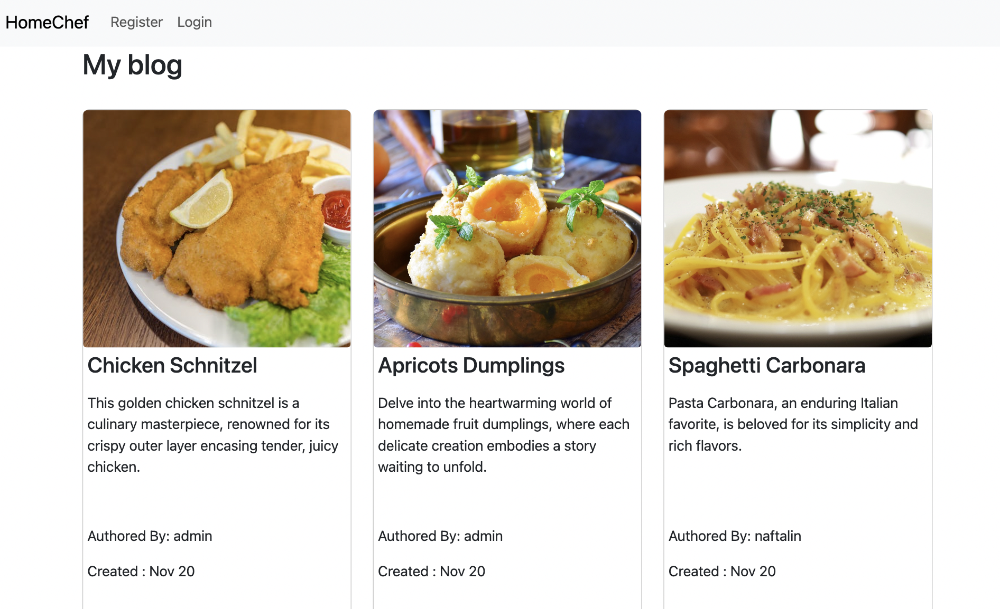

### Recipe details

Registered and logged in users are able to view, edit, comment and like recipes. Users not registered or logged in will only be able to view recipe details, without the ability to edit, comment or like.
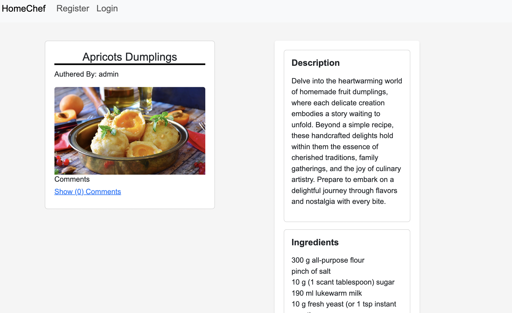

### Registered login

During registration the user must complete all the required fields: username, first name, last name, email, password, and password confirmation. Login requires the entering of both the email and password fields. After logging in the user will be redirected to the main page with recipes.
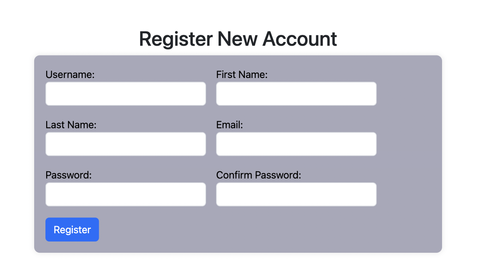
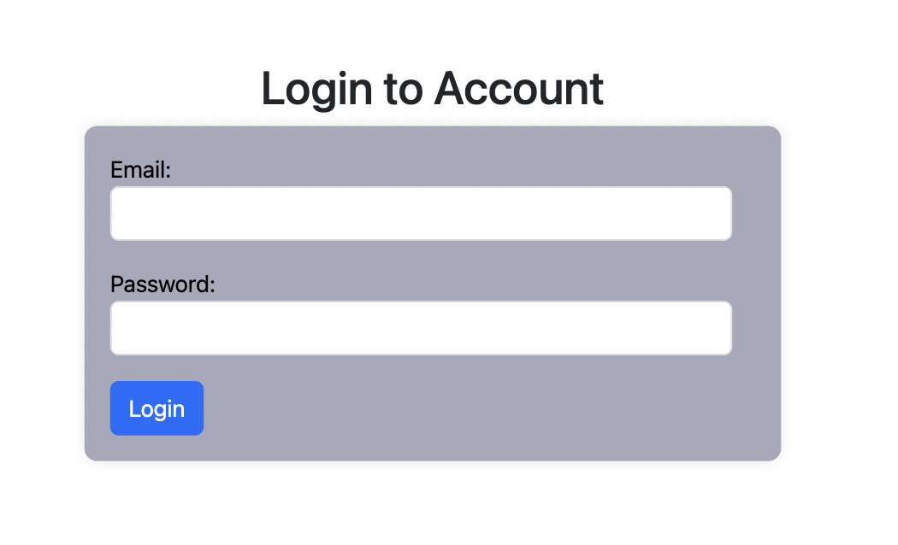

### Add new recipe

The registered and logged in user will have the option to add a recipe by clicking on the ‘Add new recipe’ option on the navigation bar. The user must enter the fields for Title, Description, Ingredients and Method. If the user does not enter all off these fields and click the submission ‘Create Recipe’ button a ‘Please fill in this field’ prompt will appear. Submitting an image is optional. If no image is submitted a default tomato image will be displayed. The user can designate the recipe post as draft or published and the click the ‘Create Recipe’ button, which will return the user to the homepage with the appearance of a ‘Recipe created successfully’ notice. Draft posts allows the admin to plan publication date and help with editing before publication. If the user designates the recipe as published, admin must first approve it before the recipe appears to the public. The user can delete or edit their own recipe. If the delete button is clicked the user is prompted with the conirmation message 'Are you sure you want to delete this recipe?' and given option to proceed with deletion or cancel. If 'cancel' is selected the user is returned to the recipe edit page. If deletion is selected the user is returned to the homepage and presented with mesage 'Recipe name of recipe was deleted successfully'.
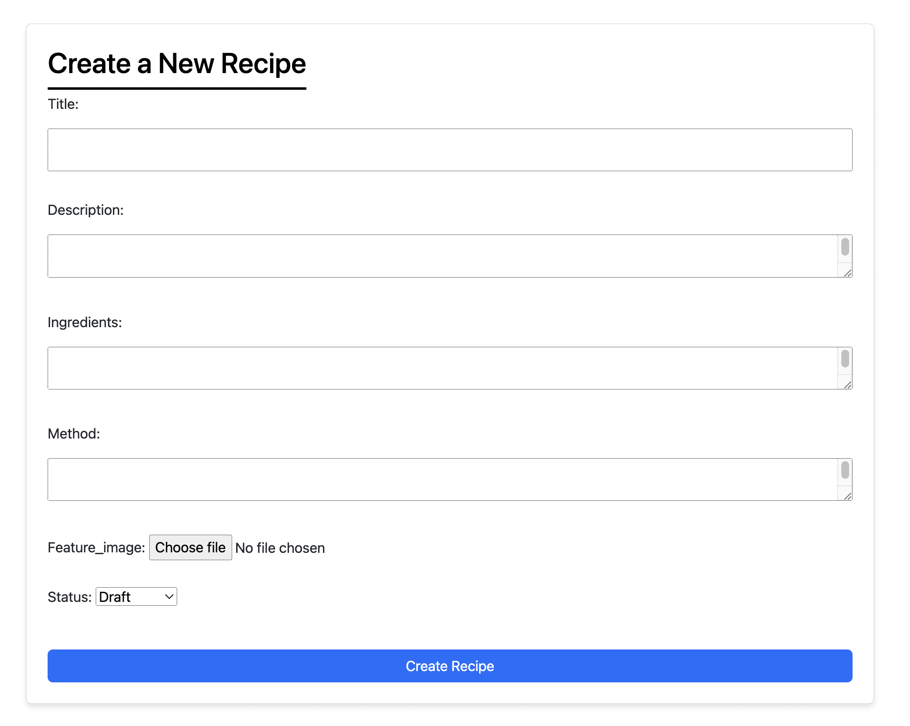

### User profile

When the user logs in the 'My Profile' tab appears in the Navbar. On clicking 'My Profile' the profile detail page opens where the profile pic, name, username,user bio and user history can be viewed. User history shows when the profile was created and last edited.

The profile can be edited with clicking of the action edit icon. It is not mandatory to fill in any fields on the profile, and if no profile pic is uploaded a default smiley face is displayed. The profile pic is displayed when a user published a comment.
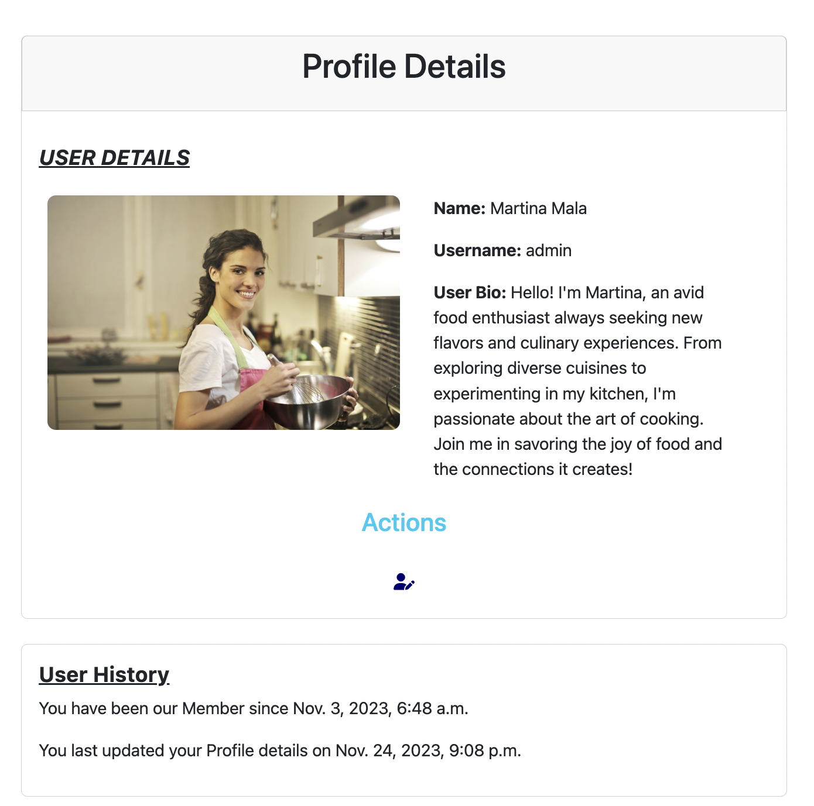

### Log out

On clicking 'Log Out' the user is redirected to the homepage where the recipes can be viewed, and with option to register and login.

### Log in

On logging in the user is given the message 'Welcome, you are now logged in'

### Comment on recipes

On posting a comment the logged in user is presented with the message 'Your comment has been created successfully. It will be visible once the admin approves.'

Once the comment has been checked and approved by the admin it will be visible.
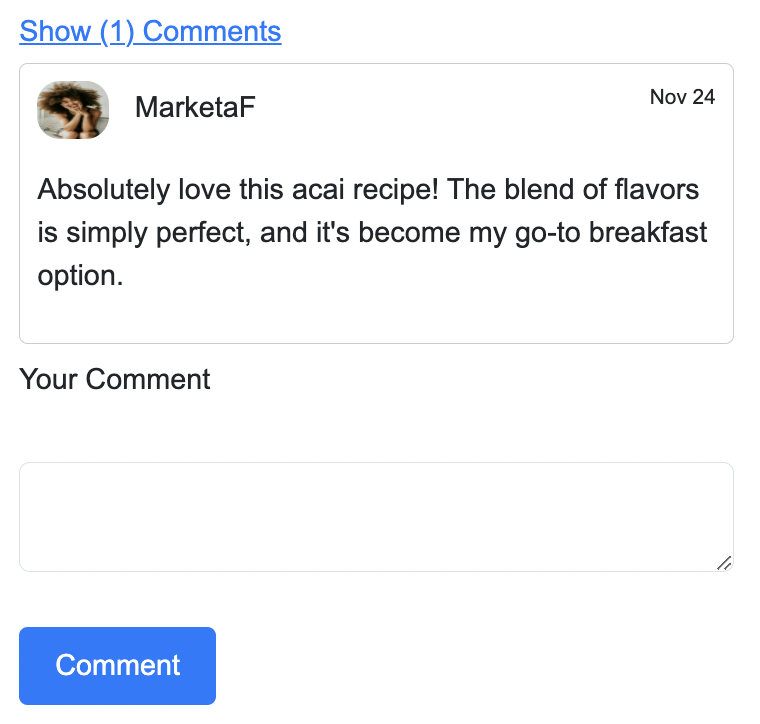

### Footer

# Testing
## Validator

HTML: No errors were found when passing through the W3C validator at the final check. Info statement was encoutered: Trailing slash on void elements has no effect and interacts badly with unquoted attribute values. This issue was not able to be removed however it has no bearing on the working of the code.
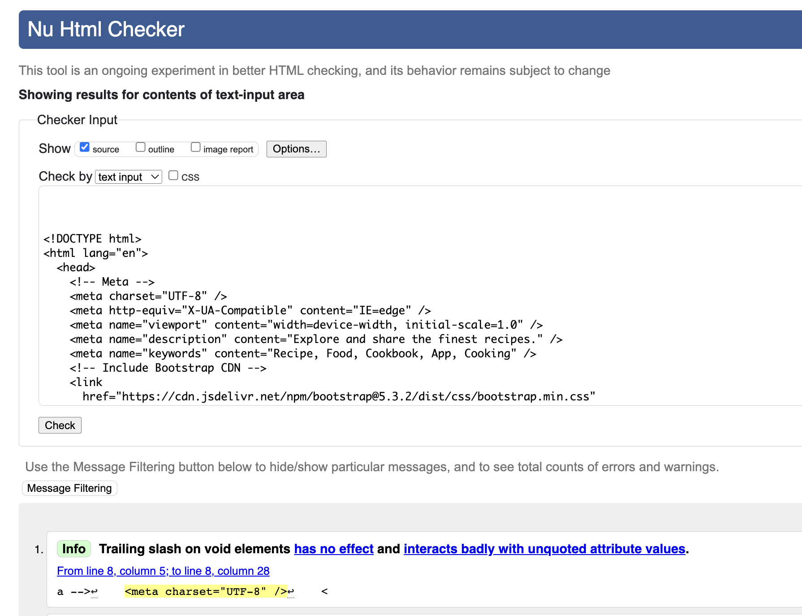

CSS: No errors were found when passing through the Jigsaw validator at the final check. 
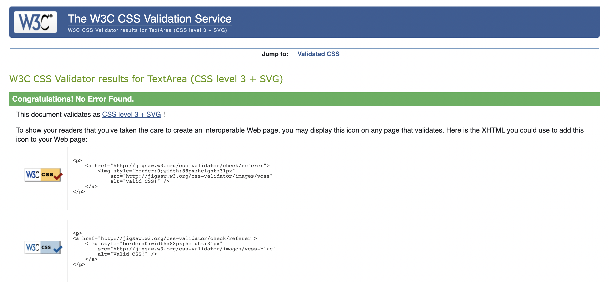

Code Institute Python Linter: was used for validation to ensure no Python code errors.
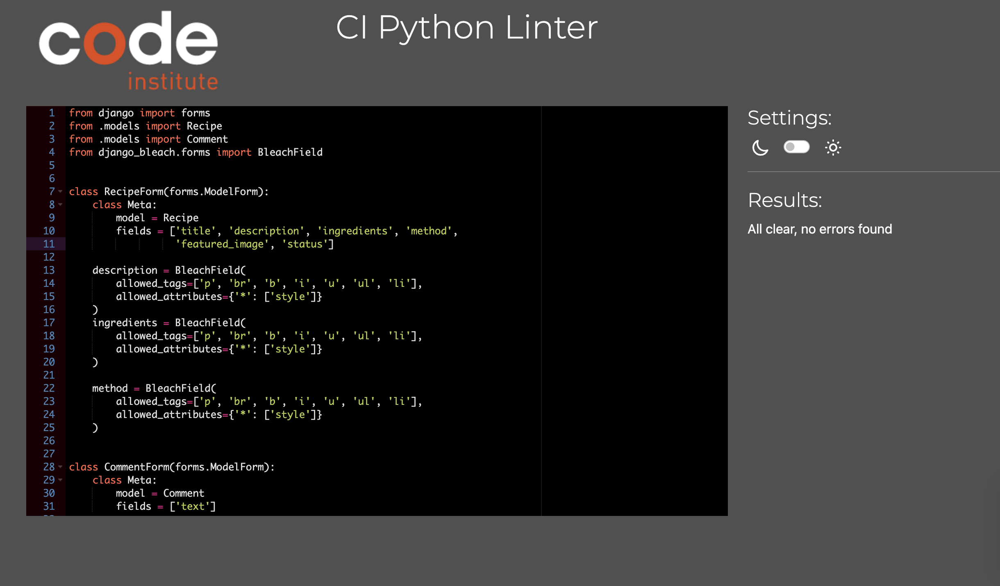

JShint validator: was used for validation to ensure no JavaScript errors.
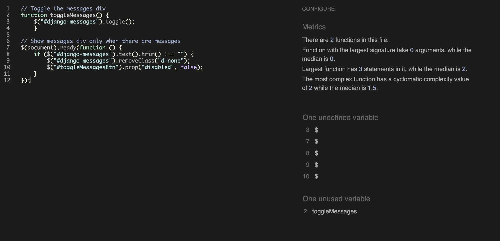 

## Testing of user stories

### User Authentication and Profiles

#### Registration Form (Must Have)

Acceptance Criteria:
Fields for username, name, email, and password must be present in the registration form.
Upon successful submission, a new user account is created.
Test Cases:
Validate presence and functionality of required fields in the registration form.
Test successful creation of a new user account after form submission.

All tests passed

#### Secure Login (Must Have)

Acceptance Criteria:
Users can securely log in using their email and password.
Test Cases:
Verify secure login functionality using valid user credentials.
Test failed login attempts with incorrect credentials.

All tests passed

### Profile Page (Could Have)

Acceptance Criteria:
Registered users can access their profile page for viewing and editing.
Test Cases:
Validate user access to the profile page after login.
Test user ability to view and edit profile information.

All tests passed

### Recipe Management

#### Creating Recipes (Must Have)

Acceptance Criteria:
Registered users can create new recipes with title, ingredients, description, method, and images.
Test Cases:
Verify successful creation of new recipes with all required details.
Test visibility of newly created recipes in the user's profile.

All tests passed

#### Editing and Deleting Recipes (Must Have)

Acceptance Criteria:
Logged-in users can edit and delete their created recipes.
Test Cases:
Test modification of recipe details (title, ingredients, description, method, images).
Test successful deletion of created recipes.

All tests passed

#### Browsing and Viewing Recipes (Must Have)

Acceptance Criteria:
All users can browse recipes and view their complete details.
Test Cases:
Validate the ability to browse and access complete recipe details.
Test page navigation and ensure display of necessary information.

All tests passed

#### Pagination for Recipe Browsing (Should Have)

Acceptance Criteria:
Users can view a maximum of 9 recipes per page and navigate between pages.
Test Cases:
Verify that the maximum number of recipes per page is displayed.
Test navigation between pages for seamless browsing.

All tests passed

### Interaction with Recipes

#### Liking Recipes (Should Have)

Acceptance Criteria:
Logged-in users can like recipes and view the number of likes.
Test Cases:
Verify the ability of logged-in users to like recipes.
Test the accurate display of the number of likes for each recipe.

All tests passed

#### Posting Comments on Recipes (Should Have)

Acceptance Criteria:
Registered users can post comments on recipes.
Test Cases:
Test that only registered and logged in users have the ability to post comments on recipes.
Validate that posted comments appear correctly under respective recipes.

All tests passed

### Admin Panel and Content Management

#### Admin Login (Must Have)

Acceptance Criteria:
Superuser/admin can securely log in to the admin panel using admin credentials.
Test Cases:
Verify secure login functionality for the admin panel using valid admin credentials.
Test unsuccessful login attempts with incorrect admin credentials.

All tests passed

#### Managing Users (Must Have)

Acceptance Criteria:
Admins can access a list of all users and manage user accounts.
Test Cases:
Validate admin access to the list of all users.
Test admin actions for managing user accounts (edit/delete).

All tests passed

#### Managing Recipes (Must Have)

Acceptance Criteria:
Admins can edit/delete any recipe on the site.
Test Cases:
Verify admin ability to edit/delete any recipe on the site.
Test that changes made by the admin reflect correctly.

All tests passed

#### Moderating Comments (Should Have)

Acceptance Criteria:
Admins can review, approve, moderate, block, edit, or delete comments.
Test Cases:
Validate admin actions for comment moderation (approve, edit, delete, block).
Test that comments are appropriately moderated according to admin actions.

All tests passed

#### Viewing Likes for Recipes (Should Have)

Acceptance Criteria:
Admins can track trends and popular recipes based on likes.
Test Cases:
Verify admin access to view likes for recipes.
Ensure accuracy in tracking and displaying popular recipes based on likes.

All tests passed

# Bugs

# Technologies

## Languages

- HTML
- CSS
- JavaScript
- Python

## Frameworks and Tools

- Django: Python framework used in the project's development.
- Bootstrap: Front-end CSS framework for design consistency.
- ElephantSQL: Production database service.
- Cloudinary: Storage solution for files and images.
- Balsamiq: Tool used for wireframe creation.
- LucidChart: Platform for designing the database schema.
- Django-Summernote: editor on admin site.
- Font Awesome: Source for icons.
- Chrome Dev Tools: Used for development and responsive testing.
- Git: Version control through Gitpod terminal for commits and pushes to GitHub.
- GitHub: Repository for storing the project's code.
- Heroku: Platform for deploying the application.

# Deployment

Live Deployment: Find the application deployed on Heroku.

## ElephantSQL (PostgreSQL) 

Utilized for the database.
Sign up using your GitHub account.
Click "Create new instance".
Give it a name.
Choose the nearest region and data center.
Access your database URL and insert it into your app as DATABASE_URL.

## Cloudinary API

Stores media assets online. To acquire your API key:
Sign up and log in.
Select "Programmable Media" as your primary interest.
Access your API environment variable, typically named CLOUDINARY_URL. Insert your API key here.

## Heroku Deployment

Utilizes Heroku as a cloud-based platform for application building, running, and operating:
In your Heroku dashboard, click "New" and select "Create new app".
Provide a unique app name and select your region.
Upon app creation, access "Config Vars" to set environment variables, including SECRET_KEY (use any random secret key), PORT (set to 8000).

Heroku Deployment Requirements:
Files Needed: requirements.txt and Procfile.
Install Project Requirements:
Use pip3 install -r requirements.txt.
Update the requirements file with installed packages using pip3 freeze --local > requirements.txt.
Create Procfile:
Generate it with echo web: gunicorn app_name.wsgi > Procfile. Replace 'app_name' with your app's name.
Heroku Site Deployment:

Automatic Deployment:
Enable automatic deployment in Heroku.
Manual Deployment Steps:
Use heroku login -i in the terminal.
Set the Heroku remote: heroku git:remote -a app_name, replacing 'app_name' with your app's name.

## Forking the Repository

Log in to GitHub or create an account.
Go to <https://github.com/nataliatesarova/project-four>.
Click "Fork" at the top-right of the repository.
A copy will be created in your own repository.

## Creating a Clone

Visit <https://github.com/nataliatesarova/project-four>.
Click the green "Code" button and choose "Clone by HTTPS".
Copy the provided URL.
In your terminal, navigate to your desired directory.
Type 'git clone [copied URL]' and press enter to clone the repository locally.

# Credits and Acknowledgments

I would like to thank my mentor Rory Sheridan and all the tutors, teachers and student colleagues for help and advice on the project.
